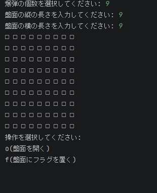
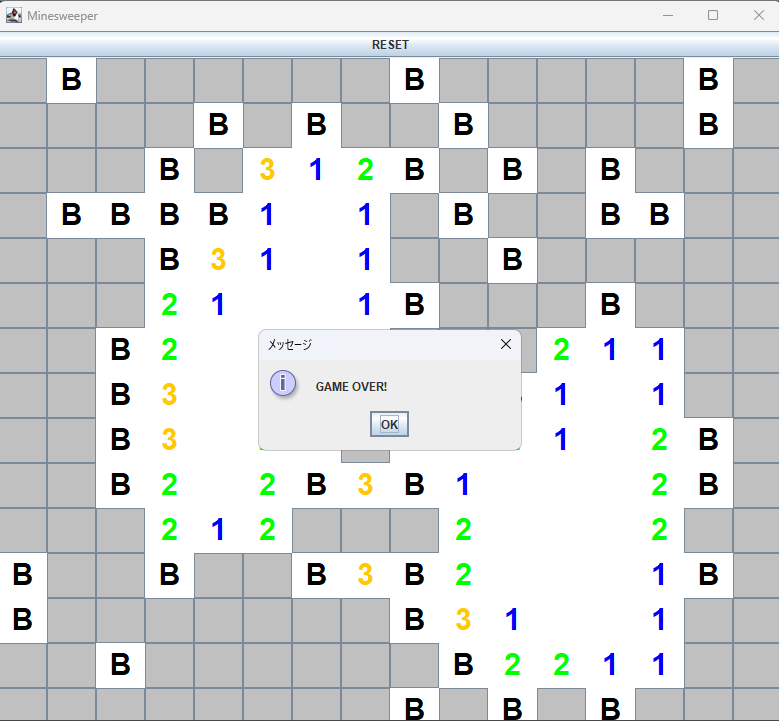

# Minesweeper

javaで開発したマインスイーパーです。

コンソール版を作成した後、swingを使用し簡易的なGUI版へ移植しました。 

訓練校で学習した二次元配列、二重for文への理解向上、オブジェクト指向を意識したクラス設計や、画面更新の仕組みを学ぶ事を目的とし製作しました。

---


## 🛠 使用技術

| 技術            | 内容               |
|---------------|------------------|
| Java          | メイン言語            |
| Java　swing    | GUI              |
| Git / GitHub  | バージョン管理/ソースコード管理 |
| IntelliJ IDEA | 開発環境             |

---

## 📸 ゲーム画面

### console版



### GUI版



---

## 🎮 プレイ方法

### コンソール版

1. 行番号を入力
2. 列番号を入力
3. 地雷を避けながらすべてのマスを開く
4. 入力方法を選び、oを入力すると盤面を開き、fを入力すると地雷があると思った場所に旗（印）を置ける

### GUI版

左クリック：マスを開く

---

## 📂 ディレクトリ構成

```text
src/
└── minesweeper/
    ├── Main.java           //GUI版エントリーポイント
    ├── ConsoleMain.java    //コンソール版エントリーポイント
    ├── Game.java           //ゲーム全体の制御
    ├── Board.java          //盤面管理
    └── GameFrame.java      //GUI画面
```
---
## ▶️ 起動方法
コンソール版
- java minesweeper.ConsoleMain

GUI版
- java minesweeper.Main

- --

## 🎯 Game Rules
- 盤面上の地雷を避けるゲーム
- 数字は周囲8マスの地雷数
- 0は連鎖的に自動オープン
- 地雷を踏むとゲームオーバー

---
## 💡 工夫した点

- メソッド名を自分にも分かりやすいよう定義
- 誰にでも分かるよう、コメントを残した
- コンソール版で核の部分を流用し、GUI版へ移植
- 役割ごとにクラスを分割し、責務を明確化
- GUIとゲームロジックを分離することを意識

---

## 📚 学習したこと

このconsole版/GUI版で学んだこと

- 二次元配列を利用した盤面表示
- 二重for文
- 入力内容の例外処理
- 再帰
- オブジェクト指向を意識したクラス設計
- swingの基本的な使い方
- イベント処理
- Git/GitHubを利用したバージョン管理

---

## 🔧 今後追加したい機能

- [ ] GUI版に画像データを挿入
- [ ] swingを使ってのブラシュアップ
- [ ] リファクタリング
- [ ] これをWEBアプリ化


